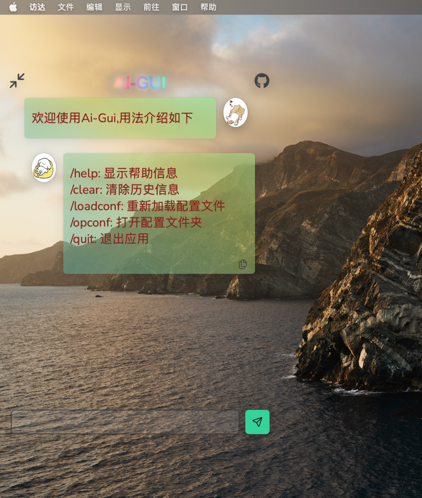

# Ai-Gui

## 关于

一个使用wails开发的简易ai问答软件

用于日常问答，可缩小图标，方便随时使用

目前gpt,千帆大模型，和支持openai协议的大模型，如星火，kimi,通义千问等

技术栈：

> wails + vue3 + ts + primevue + primeflex

## 配置

关于如何配置

> 首次启动会自动创建配置文件并打开所在文件夹

配置文件案例

```json
{
  "botType": "gpt",
  "gpt": {
    "baseUrl": "api.openai.com", 
    "apiKey": "sk-xxx" 
  },
  "qf": {
    "accessKey": "",
    "secretKey": "",
    "model": ""
  }
}
```

详细配置介绍请参考[配置文件](https://github.com/pwh-pwh/ai-gui/blob/master/sample.json)

## 使用说明

* 点击缩小图标，可以收缩聊天栏，变成小图标
* 小图标和聊天栏的标题部分都可以拖动
* 点击头像可以复制文字
* 双击标题关闭应用
* 输入/clear 清除聊天记录，重新对话

## 效果

效果图如下:

### mac系统效果

全屏



小图标


## todo

1. 历史记录
2. 多模态支持
3. 主题支持
4. 更多大模型支持
5. 👏欢迎各位提issue或者功能建议,主打轻便，暂时不考虑加入复杂功能

## 杂念

项目起因是本人想弄个方便随时提问又不占空间的ai软件

所以就使用wails实现了

## 贡献

本人才疏学浅，也欢迎各位大佬提pr优化或者增加新功能

